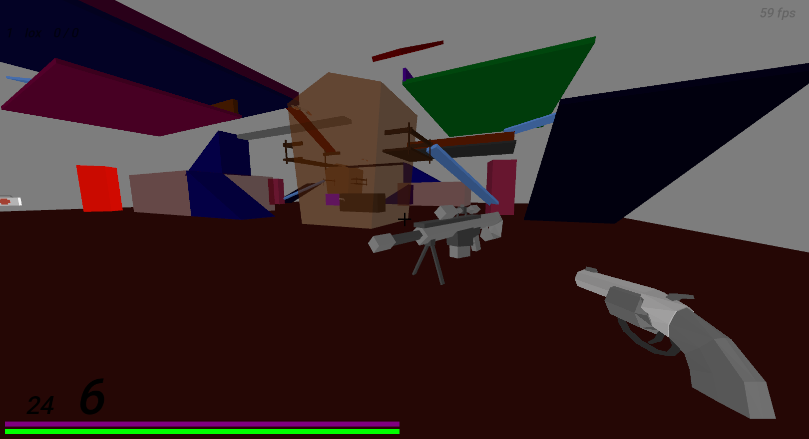

# Shooter on self-written 3D engine

<h4>About:</h4>

Source code of simple shooter on [3Dzavr game engine](https://github.com/vectozavr/3dzavr)

# Windows 10
1) Write <b>ip</b> and <b>port</b> of server in <b>connect.txt</b> file.

2) Write <b>port</b> of the server in <b>server.txt</b> file (only for computer where the server will be running).

3) Enjoy gaming!

<h4>Control:</h4>

<b>Mouse</b>, <b>Space</b>, <b>A</b>, <b>S</b>, <b>W</b>, <b>D</b> – player control.

<b>SHIFT</b> – slow motion (this ability is not infinite: its bar is next to hp)

<b>E & Q </b> or keys <b> <- -> </b> – change weapon

<b>R</b> – recharge

<b>Tab</b> – turn debug mode on/off

<h4>Playing with a source code:</h4>

1) [Download and install OpenAL library](https://openal.org/downloads/) for SFML sound support (in current version you can't setup this engine without OpenAL) and sfml 2.5.1 inpacking to C:/Libraries/SFML/lib/cmake/SFML

2) Clone this repository

3) Open project
   
   Using [CLion](https://www.jetbrains.com/clion/) compiler: open <b>CMakeList.txt</b> as a project

   # linux
4) sudo apt update 
5) sudo apt install build-essential cmake libsfml-dev libgl1-mesa-dev libglut-dev
6) mkdir build
7) cd build
8) cmake ..
Сборка конкретно сервера
9) make shooter_server

10) Built project and run the game

Structure:

GamePlay:

"# shuter_and_server" 
