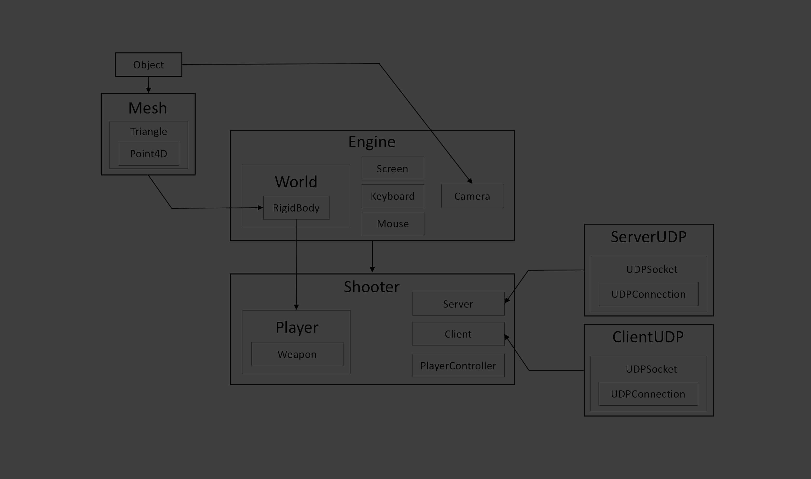
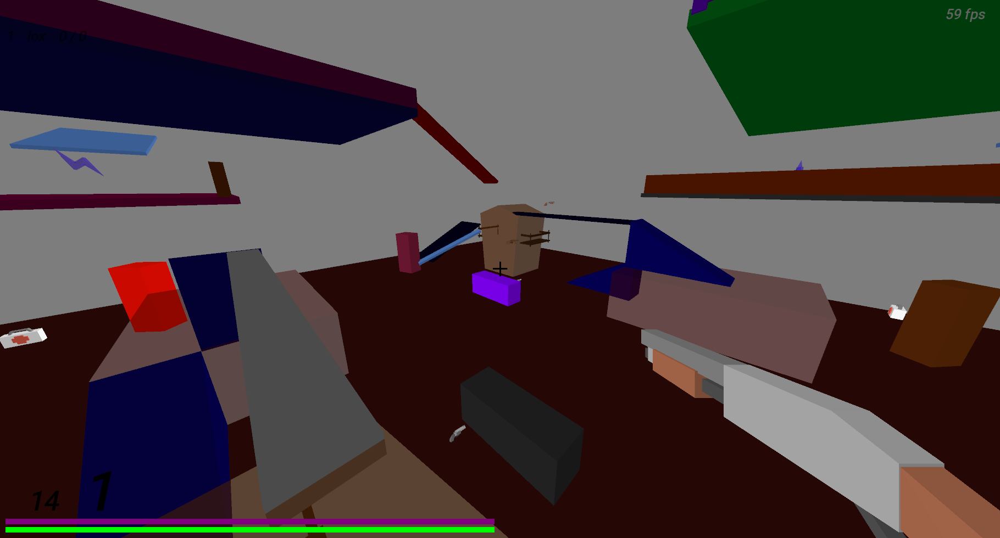
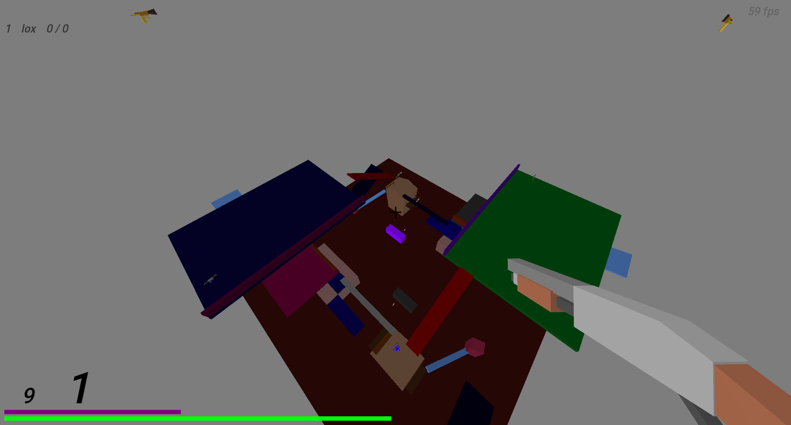

# Shooter on self-written 3D engine

<h4>About:</h4>

Source code of simple shooter on [3Dzavr game engine](https://github.com/vectozavr/3dzavr)

# Windows 10
1) Write <b>ip</b> and <b>port</b> of server in <b>connect.txt</b> file.


2) Write <b>port</b> of the server in <b>server.txt</b> file (only for computer where the server will be running).


3) Enjoy gaming!


<h4>Control:</h4>

<b>Mouse</b>, <b>Space</b>, <b>A</b>, <b>S</b>, <b>W</b>, <b>D</b> – player control.

<b>SHIFT</b> – slow motion (this ability is not infinite: its bar is next to hp)

<b>E & Q </b> or keys <b> <- -> </b> – change weapon

<b>R</b> – recharge

<b>Tab</b> – turn debug mode on/off

<h4>Playing with a source code:</h4>

1) [Download and install OpenAL library](https://openal.org/downloads/) for SFML sound support (in current version you can't setup this engine without OpenAL) and [SFML](SFML.7z) 2.5.1 inpacking to C:/Libraries/

2) Clone this repository

3) Open project

   Using [CLion](https://www.jetbrains.com/clion/) compiler: open <b>CMakeList.txt</b> as a project

   # linux
### 🚀 Быстрый запуск сервера на Ubuntu

**1. Подготовка системы:**

```bash
sudo apt update && sudo apt install -y git build-essential cmake libsfml-dev libgl1-mesa-dev freeglut3-dev

```

**2. Сборка проекта:**

```bash
git clone https://github.com/biba0807/shuter_and_server.git
cd shuter_and_server
mkdir build && cd build
cmake ..
make shooter_server -j$(nproc)

```

**3. Настройка сети (открываем порт 54000):**

```bash
sudo iptables -I INPUT -p udp --dport 54000 -j ACCEPT
sudo apt install -y iptables-persistent && sudo netfilter-persistent save

```

**4. Запуск:**

```bash
cd ..
./shooter_server

```

---

10) Built project and run the game

Structure:



GamePlay:



